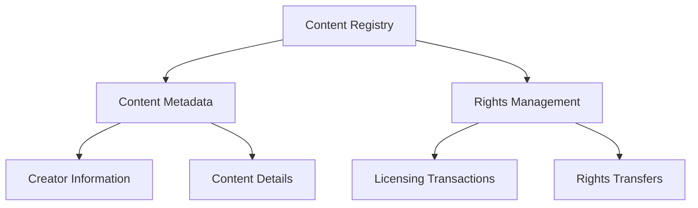

# Publish-SPL: Content Rights Management Platform

A decentralized blockchain platform for tracking, licensing, and monetizing digital content rights using Stacks blockchain technology.

## Overview

Publish-SPL enables creators to:
- Register and track digital content ownership
- Set licensing terms and pricing
- Manage content rights transfers
- Track licensing transactions
- Ensure transparent and verifiable intellectual property management

## Architecture

The system is built around a content registry that tracks ownership, licensing, and rights transfer for digital assets.



### Core Components:
- **Content Registry**: Immutable record of content metadata
- **Rights Management**: Licensing, pricing, and ownership tracking
- **Transaction Tracking**: Record of content licenses and transfers
- **Ownership Verification**: Cryptographic proof of content rights

## Contract Documentation

### Main Contract: spl-registry.clar

The primary contract handling content registration, licensing, and rights management.

#### Key Data Structures:
- `content-registry`: Stores content metadata and details
- `content-rights`: Tracks licensing terms and current rights holders
- `license-transactions`: Records individual content licensing events

## Getting Started

### Prerequisites
- Clarinet CLI
- Stacks wallet for deployment

### Basic Usage

1. Register new content:
```clarity
(contract-call? .spl-registry register-content
    "content123"
    u"My Groundbreaking Article"
    "article"
    u1000  ;; Base price
    u10    ;; Royalty percentage
    "non-exclusive"
    (some u"A deep dive into blockchain technology")
    (some u"Additional public metadata"))
```

2. Purchase a content license:
```clarity
(contract-call? .spl-registry purchase-license
    "content123"
    tx-sender
    "full-access"
    "transaction456")
```

3. Transfer content rights:
```clarity
(contract-call? .spl-registry transfer-rights
    "content123"
    new-rights-holder-principal)
```

## Function Reference

### Content Management

#### register-content
```clarity
(register-content
    (content-id (string-ascii 36))
    (title (string-utf8 100))
    (content-type (string-ascii 50))
    (base-price uint)
    (royalty-percentage uint)
    (licensing-model (string-ascii 50))
    (description (optional (string-utf8 500)))
    (public-metadata (optional (string-utf8 1000))))
```

#### purchase-license
```clarity
(purchase-license
    (content-id (string-ascii 36))
    (creator principal)
    (license-type (string-ascii 50))
    (transaction-id (string-ascii 36)))
```

#### transfer-rights
```clarity
(transfer-rights
    (content-id (string-ascii 36))
    (new-rights-holder principal))
```

## Development

### Local Testing

1. Initialize project:
```bash
clarinet new publish-spl
```

2. Run tests:
```bash
clarinet test
```

3. Start local chain:
```bash
clarinet console
```

## Security Considerations

### Content Rights
- Immutable registration of content ownership
- Transparent licensing and transfer mechanisms
- Cryptographic verification of rights

### Licensing
- Flexible licensing models
- Configurable pricing and royalties
- Transaction-level tracking

### Limitations
- Content metadata stored on-chain (keep sensitive data minimal)
- Licensing enforcement requires external systems
- No direct content hosting

### Best Practices
- Verify content uniqueness before registration
- Set reasonable royalty percentages
- Use clear, specific licensing terms
- Validate all transaction inputs